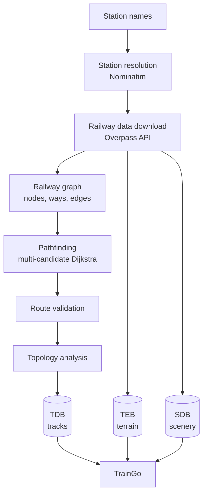

# RouteGen

**Turn two station names into a simulator-ready railway route.**

RouteGen is a Python route-generation pipeline for the **TrainGo** railway simulation ecosystem. Give it a starting and ending station and it finds a connected railway path in real-world data, analyses the track topology, and builds terrain and scenery databases around it. It replaces hours of manual route editing in tools like TSRE5 with an automated, repeatable process.


> **Status:** RouteGen is under active development. Track, terrain and scenery generation work end to end. Station, platform and relationship databases are in progress. See the [roadmap](#roadmap).

---

## Contents

- [What it does](#what-it-does)
- [How it works](#how-it-works)
- [Quick start](#quick-start)
- [Output files](#output-files)
- [The RouteGen format family](#the-routegen-format-family)
- [Designed for large routes](#designed-for-large-routes)
- [Project structure](#project-structure)
- [Data sources and attribution](#data-sources-and-attribution)
- [Known limitations](#known-limitations)
- [Roadmap](#roadmap)
- [Contributing](#contributing)
- [License](#license)

---

## What it does

You type two station names. RouteGen then:

1. **Resolves both stations** to real coordinates using OpenStreetMap's Nominatim geocoder.
2. **Downloads railway data** for the surrounding area from the Overpass API, with automatic retries and fallback across three servers.
3. **Builds a railway graph** from OSM ways, keeping track of which way produced each connection.
4. **Finds the route** between the stations with Dijkstra's algorithm, testing several candidate attachment points per station so a disconnected yard or siding doesn't derail the search.
5. **Validates the route** for missing nodes, duplicate nodes, suspicious gaps and endpoint accuracy before going further.
6. **Analyses the topology**: junctions, sidings, way transitions, connection confidence and anomalies.
7. **Exports databases** for tracks (TDB), terrain (TEB) and scenery (SDB).

RouteGen is not the simulator. It is the route-data side of TrainGo: real-world geography in, structured route data out.

---

## How it works



| Stage | Module | Purpose |
|---|---|---|
| Station resolution | `station.py` | Turns a name into a railway station with coordinates and an OSM ID |
| Data acquisition | `osm.py` | Downloads railway nodes and ways for the route's bounding box |
| Graph construction | `graph.py` | Builds the graph, edge metadata and a node-to-way index |
| Pathfinding | `pathfinder.py` | Finds the shortest connected path between the two stations |
| Validation | `validator.py` | Checks geometry and structure before topology analysis |
| Topology | `topology.py` | Classifies junctions, sidings and connections along the route |
| Track database | `tdb.py` | Exports track records, topology points and connections |
| Terrain database | `teb.py` | Downloads elevation and satellite tiles and builds terrain coverage |
| Scenery database | `sdb.py` | Merges OSM scenery with GIS building data into 3D scenery metadata |

---

## Quick start

### Requirements

- Python 3.9 or newer
- An internet connection (every stage downloads live data)
- Packages: `requests` and `numpy`

### Install

```powershell
git clone https://github.com/Deb-18-05/RouteGen.git
cd RouteGen
python -m venv .venv
.venv\Scripts\Activate.ps1
pip install -r requirements.txt
```

On macOS or Linux, activate the environment with `source .venv/bin/activate`.

### Run

Run from the project root, using module syntax:

```powershell
python -m routegen.main
```

You'll be prompted for the two stations:

```text
================================
        RouteGen 0.1
================================

Enter the starting station: <station name>
Enter the ending station: <station name>
```

RouteGen prints progress for every stage and stops with a clear error if something fails, for example if validation rejects the route.

**Tips**

- Use the station's full or common name, for example `Howrah Junction`. Station search is currently limited to India (see [Known limitations](#known-limitations)).
- The first run for a new route downloads a lot of data, so expect it to take a while. Later stages reuse cached files where they can.

---

## Output files

Generated files go into `output/`, and raw downloads go into `data/`. Both folders are git-ignored.

| Path | Contents |
|---|---|
| `data/osm_raw.json` | Raw Overpass response for the route area |
| `output/railway.tdb` | Track database |
| `output/terrain.teb` | Terrain database index |
| `output/terrain/dem/` | Elevation tiles |
| `output/terrain/satellite/` | Satellite imagery tiles |
| `output/scenery.sdb` | Scenery database |
| `output/scenery/` | Scenery staging data, OSM chunks and the cached GIS buildings file |

---

## The RouteGen format family

RouteGen's output is split into six formats. Each has one job, and together they describe a complete route.

| Format | Contains | Status |
|---|---|---|
| `.tdb` | **Track**: where the rails are, topology points, connections and way transitions | Implemented |
| `.teb` | **Terrain**: elevation and satellite imagery coverage | Implemented |
| `.sdb` | **Scenery**: buildings and other objects around the route | Implemented |
| `.stb` | **Stations**: station locations and station-level data | In progress |
| `.ptb` | **Platforms**: platforms and their relationship to stations | In progress |
| `.rtb` | **Relationships**: the connectivity layer tying all the other formats together | In progress |

```text
                 RouteGen
                    │
       ┌────────────┼────────────┐
       │            │            │
      TDB          TEB          SDB
     tracks       terrain     scenery
       │            │            │
       └────────────┼────────────┘
                    │
              ┌─────┴─────┐
              │           │
             STB         PTB
          stations    platforms
              │           │
              └─────┬─────┘
                    │
                   RTB
          relationships / connectivity
```

These are RouteGen formats. They are separate from formats used by other TrainGo components such as timetable or consist generation.

---

## Designed for large routes

Long routes mean millions of map objects, so RouteGen treats generation as a data-processing problem rather than one giant in-memory object.

- **Spatial chunking.** Large areas are split into a grid of small chunks (an experiment used roughly 216 chunks at about 0.05° resolution).
- **Persistent staging.** Intermediate results are cached on disk and staged in SQLite, so later stages don't re-parse everything.
- **Memory discipline.** An earlier approach that kept too much of the dataset in memory ran out of memory, which is why chunking and staging exist. One test dataset held about 3.6 million unique OSM elements.

```text
Raw geographic data  →  processed / intermediate data  →  RouteGen route data
```

---

## Project structure

```text
RouteGen/
├── routegen/
│   ├── main.py          # Entry point and pipeline orchestration
│   ├── station.py       # Station resolution (Nominatim)
│   ├── osm.py           # Overpass download with retries
│   ├── graph.py         # Railway graph construction
│   ├── pathfinder.py    # Route search
│   ├── validator.py     # Route validation
│   ├── topology.py      # Topology analysis
│   ├── tdb.py           # Track database export
│   ├── teb.py           # Terrain database export
│   └── sdb.py           # Scenery database export
├── data/                # Raw downloads (git-ignored)
├── output/              # Generated databases (git-ignored)
├── requirements.txt
└── README.md
```

---

## Data sources and attribution

RouteGen builds on open data. Please respect each provider's terms, especially when running it at scale.

| Data | Source |
|---|---|
| Railway, station and scenery data | © [OpenStreetMap](https://www.openstreetmap.org/copyright) contributors, ODbL |
| Station search | [Nominatim](https://nominatim.org/) (see its [usage policy](https://operations.osmfoundation.org/policies/nominatim/): light use only) |
| Railway queries | [Overpass API](https://overpass-api.de/) public servers |
| Elevation | AWS Terrain Tiles (SRTM-derived `skadi` HGT tiles) |
| Satellite imagery | Esri World Imagery tile service |
| Building footprints | Public GIS building dataset, listed through a dataset-links file |

Check the Esri imagery terms before using generated satellite tiles outside personal or research projects.

---

## Known limitations

- **India only for station search.** `station.py` restricts Nominatim to `countrycodes=in`. Routes elsewhere need that filter changed.
- **Needs the internet.** There is no offline mode yet.
- **Single route per run.** One start station and one end station, with no via-points yet.
- **Data quality varies.** Routes are only as good as the OpenStreetMap mapping in that area. Gaps or disconnected track will cause failures or odd results.
- **STB, PTB and RTB are not finished.** Station, platform and relationship data aren't exported yet.

---

## Roadmap

- [x] Station resolution
- [x] Overpass download with server fallback and retries
- [x] Topology-aware railway graph
- [x] Multi-candidate pathfinding
- [x] Route validation
- [x] Topology classification (junctions, sidings, way transitions)
- [x] TDB, TEB and SDB export
- [x] Automated core unit tests
- [ ] STB (stations) export
- [ ] PTB (platforms) export
- [ ] RTB (relationships) export
- [ ] Offline sample-dataset tests
- [ ] Via-points and multi-route support
- [ ] Support for countries beyond India
- [ ] Command-line options in place of interactive prompts

---

## Contributing

Issues and pull requests are welcome. For a bug report, please include:

- the station names you used,
- the full console output,
- the contents of the validation report if validation failed.

Run RouteGen on a small route before opening a pull request for pipeline changes.

---

## License

No license has been chosen yet. Until one is added, all rights are reserved. To allow others to use and contribute to RouteGen, add a `LICENSE` file, for example MIT or Apache-2.0, and update this section.
